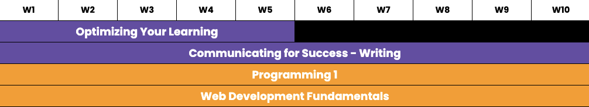
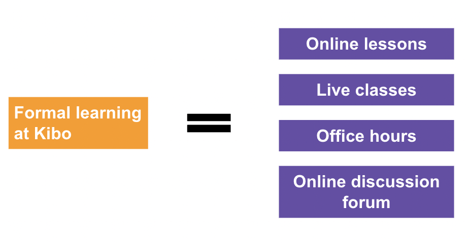
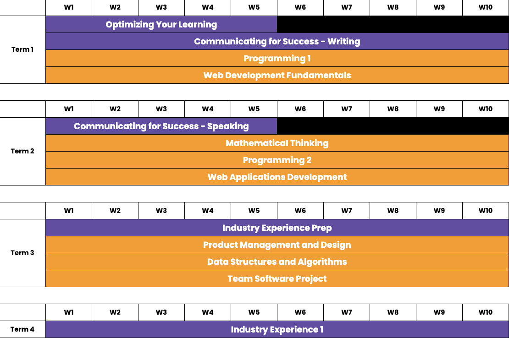

# How You Will Learn
---
## Kibo’s Learning Principles

Learning at Kibo is 1) **self-directed**, 2) **peer-supported**, 3) **active**, and 4) **relevant**.

<aside>
  
💡 **Self-directed:** We believe that education should help you become the primary agents of your learning. Because the skills professionals need are constantly changing, we help you build the autonomy, self-awareness, and discipline needed to unlearn, learn, and relearn. We minimize scheduled activities and give you the flexibility to control the time and pace of learning. However, self-directed does not mean isolated. Community plays a key role in motivation, deeper knowledge acquisition, and accountability. So, we provide support and relationships to bolster self-directed learning.

</aside>

<aside>
  
💡 **Peer-supported:** We believe that you can and should learn from each other. Peers are an asset to your learning, and their participation and contribution are required to build an effective learning community. We expect all students to be knowledge agents. Our goal is to support you in creating holistic human connections by helping you to learn how to value each other and teaching you to see each other as sources of knowledge, support, and growth. This does not mean that there is no role for instructors. Our instructors are facilitators, who create and curate engaging learning experiences and guide you in your growth.

</aside>

<aside>
  
💡 **Active:** Research shows that people learn best when they engage in active learning, i.e., learning that involves higher-order thinking. Therefore, our courses aim to help you do something with what you are learning and connect ideas. Active learning does not rule out specific learning approaches, but we strive for project and problem-based learning, discussion, and case studies. We also recognize there may be instances that warrant a more teacher-led, didactic approach.

</aside>

<aside>
  
💡 **Relevant:** Learning experiences, including instruction and assessment, should mirror real-world applications, and allow you to use newly acquired skills as you would in professional settings. You are encouraged to create artifacts that are useful outside of academic settings, and have opportunities to iterate and revise your work. However, relevance does not mean dismissing academic theory. We value giving you foundational knowledge but aim to connect it to real-world applications where possible.

</aside>

---

## How Learning Works at Kibo

Each academic year of the degree is divided into four 10-week terms. During each term, you will take between 4-5 different courses that will be a combination of general education and technical courses. Some courses will be 5 weeks in length, while the majority will run the full 10 weeks of the term. Here is an example of the courses that you will take during the first term of the degree:

**Your formal learning at Kibo will consist of the following activities:**

**Online lessons:** For each course, you will have 10-15 hours of online learning to complete each week. This will include 1) an introduction to new topics in video, text, and audio formats, 2) activities and practice exercises to help you apply the new knowledge and skills, and 3) weekly assignments to assess how well you have mastered the material. 

**Live classes:** For each course, you will also have one 90-minute live class per week with your instructor. Depending on the course, this live class could be an introduction to the content in the online learning lesson or an opportunity to apply the knowledge from the online material. 

**Office hours:** Each week, your instructors will designate certain times that they will be available to offer additional live support. During these office hours, you can bring any questions or topics that you are having trouble with, and your instructor will work with you to resolve your challenges. You can also attend office hours if you want to learn from the challenges and questions that other students have.

**Online discussion forum:** The final component of your learning at Kibo is the help channels in Discord for each course. As you are going through the online materials or after you have attended a live class or office hour or while you are working on your weekly assignments, you may have questions about certain topics. Please post these questions in the designated help channel for the course in question. This will allow your instructors and fellow students to respond to your questions in a way that could benefit other students that might have a similar question.

### So:

---

## A View of Your 1st Year at Kibo

---

## 2023 - 2024 Academic Calendar

| Day | Date | Description |
| --- | --- | --- |
| Monday | July 10, 2023 | July 2023 Term begins |
| Friday | September 15, 2023 | July 2023 Term ends |
| Monday - Friday | June 19, 2023 - July  7, 2023 | Academic Break. No classes scheduled |
| Monday | October 9, 2023 | October 2023 Term begins |
| Friday | December 15, 2023 | October 2023 Term ends |
| Monday - Friday | December 18, 2023 - January 5, 2024 | Academic Break. No classes scheduled |
| Monday | January 8, 2024 | January 2024 term begins |
| Friday | March 15, 2024 | January 2024 Term ends |
| Monday - Friday | March 18, 2024 - April 5, 2024 | Academic Break. No classes scheduled |
| Monday | April 8, 2024 | April 2024 term begins |
| Friday | June 14, 2024 | April 2024 Term ends |
| Monday - Friday | June 17, 2024 - July 5, 2024 | Academic Break. No classes scheduled |

---
