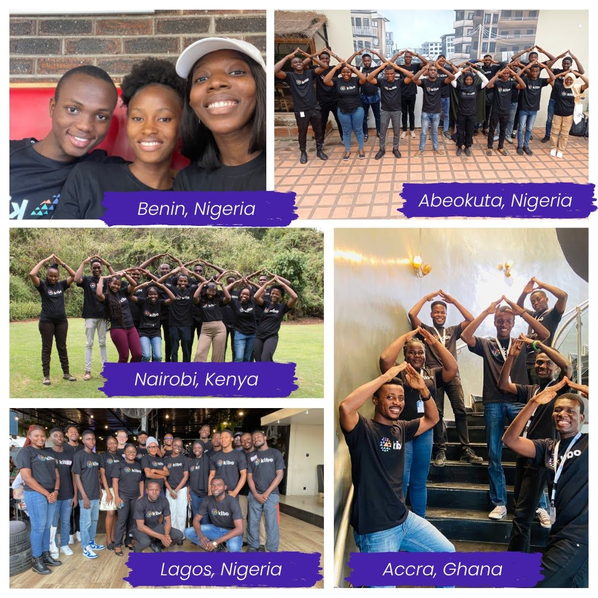
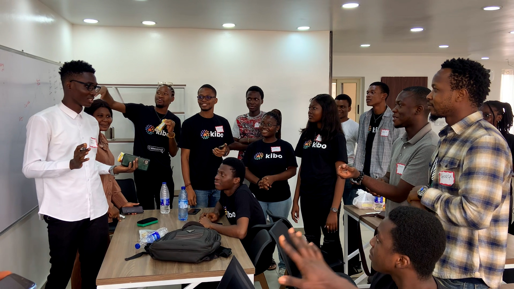
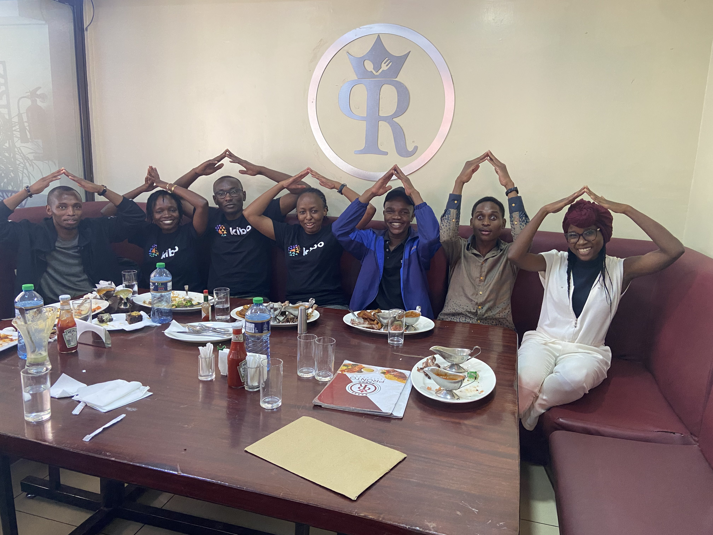

# The Kibo Community
---

At Kibo, we believe that community is one of the most important parts of an excellent learning experience. In fact, one of our values is "Better Together".  On this page, you can learn more about the different parts of the community experience at Kibo, both online and in person.

> 📺 Learn what Maryanna, a founding student in Kenya, has to say about the community at Kibo.

<iframe src="https://www.youtube.com/embed/W4C4e7buFqw" title="YouTube video player" frameborder="0" allow="accelerometer; autoplay; clipboard-write; encrypted-media; gyroscope; picture-in-picture" allowfullscreen style="position: absolute; top: 0; left: 0; width: 100%; height: 100%;"></iframe>
 

## Kibo In Real Life

### Nigeria

### Kenya

### Ghana

---

## The Squad Cup

The Squad Cup is Kibo’s intramural competition between squads. You can think of it as our version of the Hogwarts House Cup. During the term, squads complete activities to win points toward the Cup, and the squad with the most points at the end of each term is crowned the winner. 

> 📺 Watch this video from Oyin, a Kibo student advisor, to learn more about the Squad Cup
 

---

> 🗣️ **“Those who went ahead of us in the forest bent the early trees so that they grew to signals.”**
> - Margaret Atwood 

---

> 📺 Watch this video to learn what the founding students think is the best thing about Kibo. (1:46)

<iframe src="https://www.youtube.com/embed/q006VsNxv30" title="YouTube video player" frameborder="0" allow="accelerometer; autoplay; clipboard-write; encrypted-media; gyroscope; picture-in-picture" allowfullscreen style="position: absolute; top: 0; left: 0; width: 100%; height: 100%;"></iframe>
 

> 📺 Watch this video to learn more about the Kibo Community. (x:xx)

<iframe src="https://www.youtube.com/embed/oymw7SMQ9q0" title="YouTube video player" frameborder="0" allow="accelerometer; autoplay; clipboard-write; encrypted-media; gyroscope; picture-in-picture" allowfullscreen style="position: absolute; top: 0; left: 0; width: 100%; height: 100%;"></iframe>
 

---

## Using Discord (Our Community Platform)

### Step 0 - Sign Up for Discord

- If you already have a Discord account, [log in to Discord](https://discord.com/login). Otherwise, [create a Discord account](https://discord.com/register?redirect_to=%2Flogin), then check your email to verify your account. Be sure to check your spam folder if you don't see the email.
- Then join the Kibo Degree Program Discord server by clicking this link and follow the instructions to join: [https://discord.gg/Bqp2s5MY](https://discord.gg/Bqp2s5MY)

<aside>
    
⚠️ **You should download the Discord app on both your laptop and your mobile. It is the platform that Kibo School uses for the majority of our communication, and you will need to check it regularly.**

</aside>

---

### Step 1 - Introduce Yourself to the Community

1. Tell us: 
    1. Your full name
    2. Your location
    3. A fun fact about you.
2. Then post an image or gif that represents you.

**TIP:** Post your text message first, then post your gif/image as a separate message afterward.

### Step 2 - Complete the Rest of the Onboarding Steps.

Follow the instructions on the screen and complete the rest of the onboarding steps.

### Step 3 - Set Up Your Profile

> 📺 Watch this video to learn how to update your profile in Discord. (x:xx)

<iframe src="https://www.youtube.com/embed/AOU9ODzPsNc" title="YouTube video player" frameborder="0" allow="accelerometer; autoplay; clipboard-write; encrypted-media; gyroscope; picture-in-picture" allowfullscreen style="position: absolute; top: 0; left: 0; width: 100%; height: 100%;"></iframe>
  

Here is a summary of the steps to update your profile:

1. Click on your username in the right sidebar, then click the pencil icon to edit your profile.
2. Select “Edit Server Profile"
3. Update your **nickname** to your first name and last name initial **(e.g., Oyin A, Ope B)**. This will change your nickname in the Kibo Degree Program server only.

To customize the rest of your profile:

1. Click again on your username in the right sidebar. This time click "Edit User Profile".
2. Upload a profile photo as your **avatar.**
3. In the About Me section, add a **description** with a sentence or two about who you are, or include a quote you like.

### Step 4 - Read, React, and Reply to Your Classmates’ Introductions

Spend some time reading through your classmates’ introductions. 

Maybe you’ll find someone with a similar interest as you or someone who lives in the same city as you! You can create a thread to write a reply to one of the posts or add your thoughts to a thread that has already been created. If you press the Control key and click on the message that you want to respond to, you will get a small menu with different options for what you can do. You can also click the emojis symbol with a + sign to add an emoji reaction to the post.

### Step 5 - Review the Server Guide 

Review the Server Guide to watch a video walkthrough of our server and get links to additional resources on how to use Discord.

---
