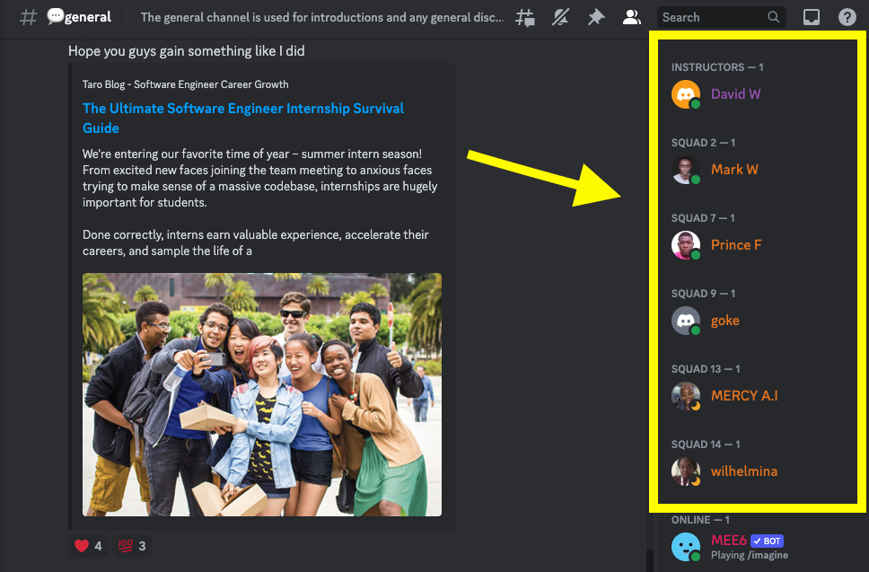
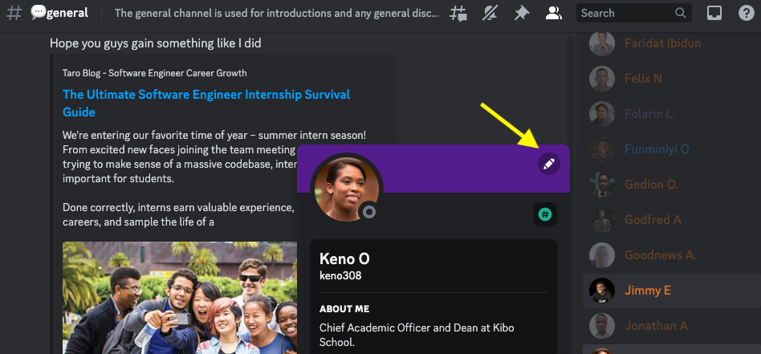
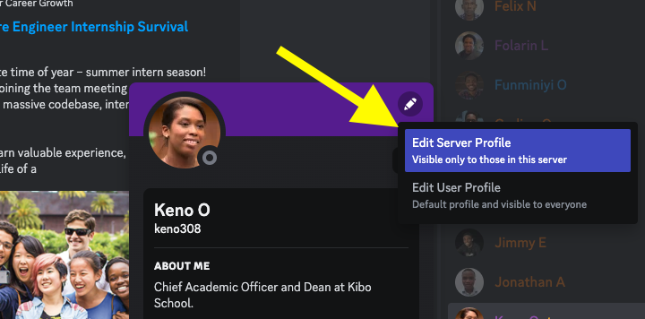
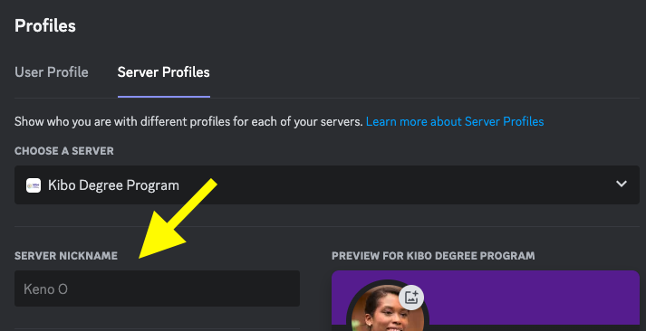
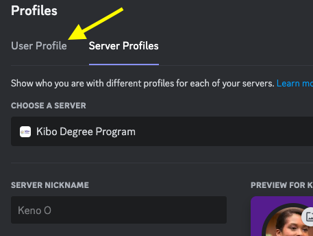

# Using Discord (Our Community Platform)

---

## Step 0 - Sign Up for Discord

- If you already have a Discord account, [log in to Discord](https://discord.com/login). Otherwise, [create a Discord account](https://discord.com/register?redirect_to=%2Flogin), then check your email to verify your account. Be sure to check your spam folder if you don't see the email.
- Then join the Kibo Degree Program Discord server by clicking this link and following the instructions to join: [https://discord.gg/kBVdDg3MqB](https://discord.gg/kBVdDg3MqB) 

<aside>
    
⚠️ **You should download the Discord app on both your laptop and your mobile. It is the platform that Kibo School uses for the majority of our communication, and you will need to check it regularly.**

</aside>

---

## Step 1 - Introduce Yourself to the Community

Go to the [Introductions channel](https://discord.com/channels/1018949047626760252/1120361847116279828) and introduce yourself to the community by telling us:
    1. Your full name
    2. Your location
    3. A fun fact about you.
    4. Then post an image or gif that represents you.

**TIP:** Post your text message first, then post your gif/image as a separate message afterward.

## Step 2 - Set Up Your Profile

1. Find your username in the right sidebar.

2. Click on your username in the right sidebar, then click the pencil icon to edit your profile.

3. Select “Edit Server Profile"

4. Update your **Server Nickname** to your first name and last name initial **(e.g., Oyin A, Ope B)**. This will change your nickname in the Kibo Degree Program server only.

To customize the rest of your profile:

1. Now go to "User Profile".

2. Upload a profile photo as your **avatar.**
3. In the About Me section, add a **description** with a sentence or two about who you are, or include a quote you like.

## Step 3 - Read, React, and Reply to Other People's Introductions

Spend some time reading through your classmates’ introductions. 

Maybe you’ll find someone with a similar interest as you or someone who lives in the same city as you! You can create a thread to write a reply to one of the posts or add your thoughts to a thread that has already been created. If you press the Control key and click on the message that you want to respond to, you will get a small menu with different options for what you can do. You can also click the emojis symbol with a + sign to add an emoji reaction to the post.

## Step 4 - Add Your Birthday to the Server [Optional]

Type this message in the #random channel: **/remember-birthday MM-DD** 

Where MM is the numerical month of your birthday (March = 03) and DD is the day. So March 8 would be 03-08.

---
